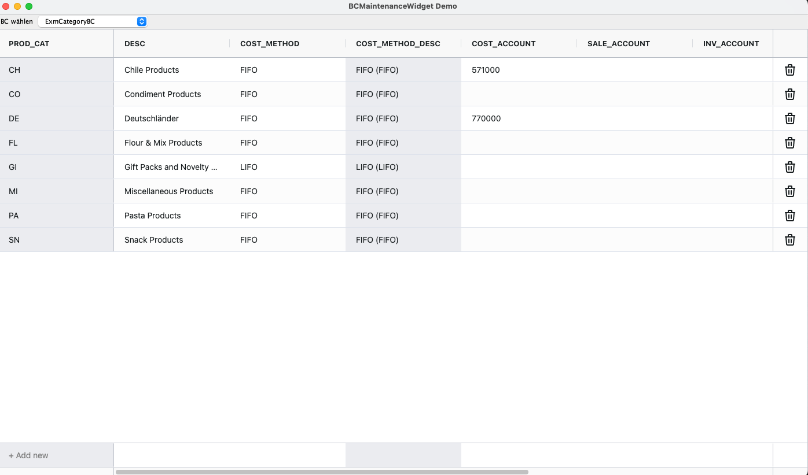

# BCMaintenanceWidget

A BBjWidget that can be used to maintain your BC's



## Setup
```
declare BCMaintenanceWidget editor!
editor! = new BCMaintenanceWidget(wnd)
editor!.setBC(bc!)
``` 

You can use the refresh() method to clear the data in the grid and fill it with a new retrieve.

Currently, the Widget does not honor the field selection.

## Lookups

If your BC contains any lookups, the Widget will build a box with all entrys to show/select when editing or creating a new entry.

If you specify the %SEARCH field in the attributes record, you will be able to search in that box. <br>
For a BBjDatabase you can set up the Lucene search, and for all other Database types you need to build a filter query with SQL.

If the Widget can not build the Box, it will promt at the start.